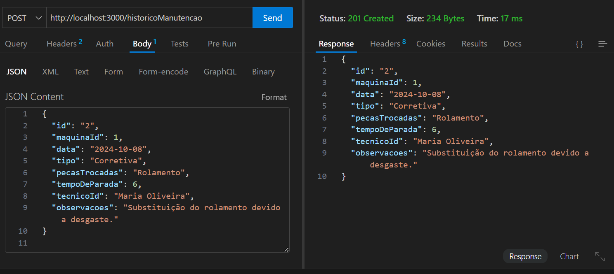

# Sistema de Manutenção Preventiva e Corretiva

## Definição do Tema

O **Sistema de Manutenção Preventiva e Corretiva** é um software destinado ao gerenciamento do ciclo de vida de máquinas e equipamentos industriais, com o objetivo de minimizar o tempo de inatividade e otimizar a performance operacional. Ele permite o controle de manutenções preventivas (realizadas regularmente para evitar falhas) e corretivas (realizadas após uma falha). O sistema também inclui funcionalidades para registrar falhas, gerenciar técnicos, gerar relatórios e acompanhar indicadores de desempenho, como o **MTTR** (Mean Time to Repair - Tempo Médio de Reparo) e o **MTBF** (Mean Time Between Failures - Tempo Médio Entre Falhas).

---

## Análise de Requisitos e Escopo

### Funcionalidades Principais:

#### 1. Gerenciamento de Máquinas e Equipamentos:
- Cadastro de máquinas, incluindo especificações técnicas, data de aquisição e localização.
- Visualização e edição de informações de máquinas.

#### 2. Registro e Controle de Manutenções:
- Registro de manutenções preventivas e corretivas.
- Histórico completo de manutenções para cada máquina.
- Registro de peças substituídas e tempo de inatividade.

#### 3. Gerenciamento de Falhas:
- Registro de falhas ocorridas, classificando a severidade e identificando o operador.
- Controle de falhas por máquina.

#### 4. Gerenciamento de Técnicos:
- Cadastro de técnicos, incluindo suas especialidades e disponibilidade.

#### 5. Relatórios e Indicadores:
- Geração de relatórios de manutenção, tempo de inatividade, falhas e peças trocadas.
- Cálculo de indicadores como **MTTR** e **MTBF**.

#### 6. Integração com API:
- Utilização de uma **API REST (JSON-Server)** para armazenar e recuperar dados.

---

## Requisitos Funcionais:
- O sistema deve permitir o cadastro de máquinas com suas especificações.
- O sistema deve registrar manutenções preventivas e corretivas, associando técnicos e peças trocadas.
- O sistema deve gerar relatórios de manutenção e indicadores de performance.
- O sistema deve oferecer uma interface gráfica intuitiva para o usuário final.

---

## Requisitos Não Funcionais:
- O sistema deve ser responsivo, com tempo de resposta rápido ao realizar operações com a API.
- A interface deve ser amigável e permitir fácil navegação entre as funcionalidades.
- O sistema deve armazenar e recuperar dados de maneira segura e eficiente.

---

# Escopo do Projeto

## Objetivos:

- **Desenvolvimento da Interface Gráfica**: Criar uma interface intuitiva utilizando **Swing** que permita o gerenciamento eficiente de máquinas, técnicos e manutenções, garantindo uma experiência de usuário fluida.

- **Implementação de Funcionalidades CRUD**: Desenvolver operações **Create, Read, Update e Delete** para o gerenciamento de máquinas, manutenções, falhas e técnicos, assegurando a integridade e a atualização constante das informações.

- **Geração de Relatórios Detalhados**: Implementar a funcionalidade de geração de relatórios abrangentes que analisem os dados registrados e apresentem indicadores de desempenho relevantes, como **MTTR** (Tempo Médio de Reparo) e **MTBF** (Tempo Médio Entre Falhas).

- **Integração com API**: Estabelecer uma conexão robusta com uma **API REST** para a armazenagem e manipulação de dados em tempo real, garantindo a sincronização e a disponibilidade das informações.

- **Validação e Testes Abrangentes**: Conduzir um processo rigoroso de validação e testes em todas as etapas do desenvolvimento para assegurar a robustez, a confiabilidade e a segurança do sistema, minimizando riscos de falhas durante a operação.

---

## Levantamento de Recursos:

### Tecnológicos:
- **Linguagem de Programação**: Java.
- **Banco de Dados**: Conexão via API REST para armazenamento e recuperação de dados.
- **Bibliotecas**: Bibliotecas Java para geração de relatórios e cálculos de indicadores.
- **Ferramentas de Teste**: JUnit ou Mockito para testes de unidade e integração.
  
### Humanos:
- **Desenvolvedor Back-end**: Responsável pela API, integrações e armazenamento de dados.
- **Desenvolvedor Front-end**: Desenvolvimento da interface gráfica  e implementação de CRUD.
- **Testador/QA**: Validação de funcionalidades e execução de testes para garantir a qualidade do software.
  
### Outros:
- **Ambiente de Desenvolvimento**: Ambiente integrado com controle de versão (ex: Git).
- **Infraestrutura de Rede**: Necessária para comunicação em tempo real com a API.

---

## Análise de Riscos:

### Riscos Técnicos:
- **Integração com API**: Problemas de conectividade ou tempo de resposta da API podem impactar a performance.
- **Falta de Familiaridade com interface gráfica**: A equipe pode ter dificuldade em desenvolver uma interface gráfica rica e amigável.
- **Inconsistência de Dados**: Erros no armazenamento ou recuperação de dados podem comprometer a confiabilidade dos relatórios e dos indicadores.

### Riscos Operacionais:
- **Falta de Recurso Humano Especializado**: Possíveis atrasos caso não haja desenvolvedores especializados em Swing ou integração com APIs.
- **Dependência de API Externa**: Caso a API não esteja disponível ou apresente instabilidade, as funcionalidades de armazenamento e manipulação de dados serão afetadas.

---

### Mitigações:
- **Testes Automatizados e Validação Constante**: Implementação de testes em todas as camadas do sistema para minimizar erros.
- **Backup Local**: Armazenamento temporário dos dados localmente, caso a API esteja indisponível.
- **Treinamento de Equipe**: Capacitar a equipe no uso de tecnologias e bibliotecas adequadas, como Swing, para evitar gargalos de desenvolvimento.

# Documentação do Sistema de Manutenção

## Diagrama de Classe

## Diagrama de Fluxo

## Diagrama de Casos de Uso

## Testes http://localhost:3000/maquinas GET

## Testes http://localhost:3000/maquinas POST

## Testes http://localhost:3000/maquinas PUT

## Testes http://localhost:3000/maquinas DELETE

## Testes http://localhost:3000/historicoManutencao GET

## Testes http://localhost:3000/historicoManutencao POST

## Testes http://localhost:3000/falhas GET

## Testes http://localhost:3000/falhas POST

## Testes http://localhost:3000/tecnicos GET

## Testes http://localhost:3000/tecnicos POST

## Testes http://localhost:3000/delete POST
